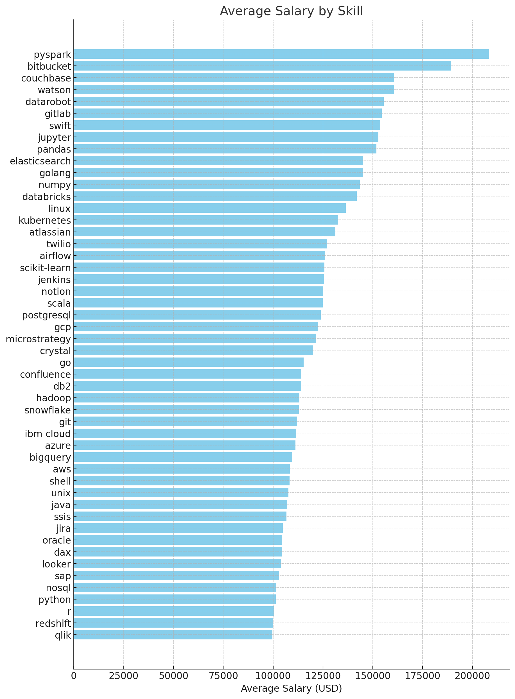
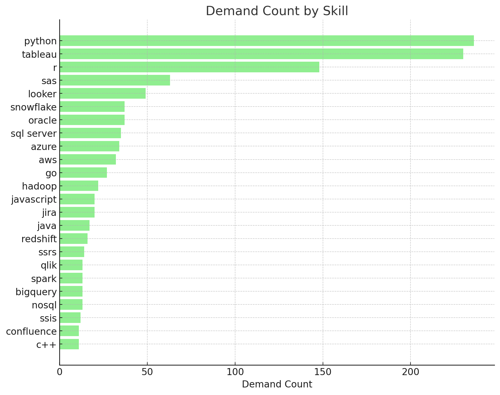

# Introduction

This project explores: top-paying-jobs with health insurance, in-demand-skills, and where high demand meets high salary in data analytics.

For SQL queries kindly check them out here: [project_sql_folder](/project_sql/)

# Background

The question i wanted to answer using SQL queries were:

1. What are the top-paying data analyst jobs?
2. What skills are required for these top-paying-jobs?
3. What skills are most demand for data analysts?
4. Which skills are associated with higher salaries?
5. What are the most optimal skills to learn?

# Tools I Used

- **SQL:** The backbone of my analysis, allowing me to query the database and unearth critical insights.
- **PostgreSQL:** The chosen database management (DBMS) ideal for handling the job posting data.
- **Visual Studio Code:** My most used and familiar with text editor for database management and executing SQL queries
- **Git & GitHub:** Essensial for version control and sharing my SQL scripts and analysis, ensuring collaboration and project tracking

# The Analysis

Each query for this project aimed at investigating specific aspect of the data analyst job market.
Here is how I approached each quetion:

### 1. Top Paying Data Analyst Jobs and Location

This query highlights the high paying opportunities in the field.

```sql
SELECT
    job_id,
    job_location,
    salary_year_avg,
    job_title,
    job_schedule_type,
    job_health_insurance,
    name as company_name,
    job_posted_date
FROM
    job_postings_fact
LEFT JOIN company_dim ON job_postings_fact.company_id = company_dim.company_id
WHERE
    job_title LIKE 'Data Analyst' AND
    job_location = 'Anywhere' AND
    salary_year_avg IS NOT NULL
    -- job_health_insurance IS TRUE
ORDER BY salary_year_avg DESC

LIMIT 10;
```

Breakdown:

- **Wide Salary Range:** Top 10 paying data analyst roles with health insurance span from $135,000 to $650,000, indicating significant salary potential in the field.
- **Salary and Health Insurance:** The most high paying salary companies like Mantys and, Plexus is not providing Health Insurance instead Get It Recruit, Level, and Uber getting the health insurance for the employees
- **Skills demand:** SQL and Python mostly used by the top 3 company from this and most worth skills to learn

| Salary Year Avg | Health Insurance | Company Name                            | Skills                                                                                              |
| --------------- | ---------------- | --------------------------------------- | --------------------------------------------------------------------------------------------------- |
| $165,000        | Not Available    | Plexus Resource Solutions               | python, mysql, aws                                                                                  |
| $165,000        | Available        | Get It Recruit - Information Technology | sql, python, r, sas, matlab, pandas, tableau, looker                                                |
| $151,500        | Available        | Get It Recruit - Healthcare             | sql, python, r                                                                                      |
| $145,000        | Available        | Level                                   | sql, python, r, golang, elasticsearch, aws, bigquery, gcp, pandas, scikit-learn, looker, kubernetes |
| $145,000        | Not Available    | CyberCoders                             | python, java, r, javascript, c++, tableau, power bi, qlik                                           |
| $140,500        | Available        | Uber                                    | sql, python, r, swift, excel, tableau, looker                                                       |
| $138,500        | Not Available    | Overmind                                | sql, python                                                                                         |
| $135,000        | Not Available    | InvestM Technology LLC                  | sql, excel, power bi                                                                                |
| $135,000        | Available        | EPIC Brokers                            | excel                                                                                               |

### 2. Skills for top paying jobs

This Data suggests that aspiring data analysts should focus on developing a strong foundation in SQL and Python, while also gaining proficiency in statistical analysis (R), data visualization tools, and cloud platforms. The ability to work with multiple technologies and adapt to new tools appears to be highly valued in the current job market for data analysts.

```sql
WITH top_paying_jobs AS(
    SELECT
        job_id,
        salary_year_avg,
        job_title,
        job_health_insurance,
        name as company_name
    FROM
        job_postings_fact
    LEFT JOIN company_dim ON job_postings_fact.company_id = company_dim.company_id
    WHERE
        job_title LIKE 'Data Analyst' AND
        job_location = 'Anywhere' AND
        salary_year_avg IS NOT NULL
    ORDER BY salary_year_avg DESC
    LIMIT 10
)

SELECT
    top_paying_jobs.*,
    skills
FROM
    top_paying_jobs
INNER JOIN
    skills_job_dim ON top_paying_jobs.job_id = skills_job_dim.job_id
INNER JOIN
    skills_dim ON skills_job_dim.skill_id = skills_dim.skill_id
ORDER BY salary_year_avg DESC
```


### 3. Most In-Demand Skills

This query shows most in demand skills in Data Analyst roles and to be specified with country in Singapore for Data Analyst that want to work there

```sql
SELECT
    skills,
    COUNT(job_postings_fact.job_id) AS demand_count
FROM
    job_postings_fact
INNER JOIN
    skills_job_dim ON job_postings_fact.job_id = skills_job_dim.job_id
INNER JOIN
    skills_dim ON skills_job_dim.skill_id = skills_dim.skill_id
WHERE
    job_title_short = 'Data Analyst' AND
    -- job_work_from_home = TRUE
    job_country = 'Singapore'
GROUP BY
    skills
ORDER BY
    demand_count DESC
LIMIT 5;
```

| Skill   | Demand 📊 |
| ------- | --------- |
| SQL     | 3,665     |
| Python  | 3,110     |
| Excel   | 2,309     |
| Tableau | 2,216     |
| R       | 1,326     |

Description:

- **SQL** leads with the highest demand
- **Python** is in second place
- **Tableau** is the most sought after visualization tool
- **Excel** is still very relevant in the data era
- **R**, despite being in last place, still has significant demand

### 4. Skills with Higher Salaries

Quick Insight:

1. High Demand for Big Data and Cloud Skills: Technologies related to big data processing (like PySpark) and cloud platforms (AWS, GCP, Azure) command the highest average salaries, indicating strong market demand for these skills.

2. Specialization Pays Off: More specialized or niche skills (e.g., PySpark, Couchbase, DataRobot) tend to offer higher average salaries compared to more general skills like Python or R, suggesting that specialization can be financially rewarding.

3. Emerging Technologies are Valued: Skills in newer technologies such as Kubernetes, Airflow, and Snowflake show competitive average salaries, reflecting a trend towards modern, scalable infrastructure in data analysis and a market willing to pay for expertise in these areas.

```sql
SELECT
    skills,
    ROUND(AVG(salary_year_avg), 0) as avg_salary
FROM
    job_postings_fact
INNER JOIN
    skills_job_dim ON job_postings_fact.job_id = skills_job_dim.job_id
INNER JOIN
    skills_dim ON skills_job_dim.skill_id = skills_dim.skill_id
WHERE
    job_title_short = 'Data Analyst'
    AND salary_year_avg IS NOT NULL
    AND job_work_from_home = TRUE
    -- job_country = 'Singapore'
GROUP BY
    skills
ORDER BY
    avg_salary DESC
LIMIT 50;
```



### 5. Optimal Skills for Job Market Value

This is a query to find which is the most optimal skills to learn for the job market values

```sql

WITH skills_demand AS(
    SELECT
        skills_dim.skill_id,
        skills_dim.skills,
        COUNT(job_postings_fact.job_id) AS demand_count
    FROM
        job_postings_fact
    INNER JOIN
        skills_job_dim ON job_postings_fact.job_id = skills_job_dim.job_id
    INNER JOIN
        skills_dim ON skills_job_dim.skill_id = skills_dim.skill_id
    WHERE
        job_title_short = 'Data Analyst' AND
        job_work_from_home = TRUE
        -- job_country = 'Singapore'
        AND salary_year_avg IS NOT NULL
    GROUP BY
        skills_dim.skill_id
), average_salary AS (
        SELECT
        skills_job_dim.skill_id,
        ROUND(AVG(salary_year_avg), 0) as avg_salary
    FROM
        job_postings_fact
    INNER JOIN
        skills_job_dim ON job_postings_fact.job_id = skills_job_dim.job_id
    INNER JOIN
        skills_dim ON skills_job_dim.skill_id = skills_dim.skill_id
    WHERE
        job_title_short = 'Data Analyst'
        AND salary_year_avg IS NOT NULL
        AND job_work_from_home = TRUE
        -- job_country = 'Singapore'
    GROUP BY
        skills_job_dim.skill_id
)

SELECT
    skills_demand.skill_id,
    skills_demand.skills,
    demand_count,
    avg_salary
FROM
    skills_demand
INNER JOIN average_salary ON skills_demand.skill_id = average_salary.skill_id
WHERE demand_count>10
ORDER BY
    avg_salary DESC,
    demand_count DESC

/* Rewrite this same query more concisely*/
SELECT
    skills_dim.skill_id,
    skills_dim.skills,
    COUNT(job_postings_fact.job_id) AS demand_count,
    ROUND(AVG(salary_year_avg), 0) as avg_salary
FROM job_postings_fact
INNER JOIN skills_job_dim ON job_postings_fact.job_id = skills_job_dim.job_id
INNER JOIN skills_dim ON skills_job_dim.skill_id = skills_dim.skill_id
WHERE
        job_title_short = 'Data Analyst'
        AND salary_year_avg IS NOT NULL
        AND job_work_from_home = TRUE
        -- job_country = 'Singapore'
GROUP BY
    skills_dim.skill_id
HAVING
    COUNT(job_postings_fact.job_id) > 10
ORDER BY
    avg_salary DESC,
    demand_count DESC
LIMIT 25;
```

Here's a brief insight into the data:

1. Python and Tableau have significantly higher demand counts compared to other skills.
   Go (Golang) has the highest average salary, despite lower demand.
2. Some specialized skills like Snowflake and Azure have relatively high salaries and moderate demand.
3. Traditional programming languages like Java and C++ are present but not at the top in terms of demand or salary.



# What I Learned

Throughout this adventure, I've learned a lot about SQL from zero (knowing nothing) to one (a bit more knowledge SQL query) although i need to practice and learn more with this language to more sharpening my skills here are my most learned SQL toolkit while im learning:

- **Complex Query Crafting:** Advancing the art or advance SQL, merging tables so good and wielding WITH clauses for ninja-level temp table maneuvers
- **Data Aggregation:** Got cozy with GROUP BY and turned aggregate functions like COUNT() and AVG() also ORDER BY into my data-summarizing sidekicks.
- **Analytical Insight:** Turning raw data into something that can make me know what the best decision to make through data.

# Conclusion

## Insights

1. **Top Paying Data Analyst Jobs and Location :** The highest-paying jobs for data analysts that allow remote-work offer a wide range of salaries, the highest at $650,000
2. **Skills for top paying jobs :** High-paying data analysts jobs with health insurance require advanced proficientcy in SQL, suggesting it's a critical skill for earning a top salary.
3. **Most In-Demand Skills :** SQL is also the most demanded skill in data analyst job market, thus making it essential for the job seekers.
4. **Skills with Higher Salaries :** High Demand for Big Data and Cloud Skills command the highest average salaries, Specialization Pays Off: More specialized or niche skills (e.g., PySpark, Couchbase, DataRobot) tend to offer higher average salaries compared to more general skills
5. **Optimal Skills for Job Market Value :** Python and Tableau have significantly higher demand counts compared to other skills. Go (Golang) has the highest average salary, despite lower demand.

### Closing Thoughts

This project realy enhanced my SQL skils and provide valuable insights into the Data Analyst job market.
